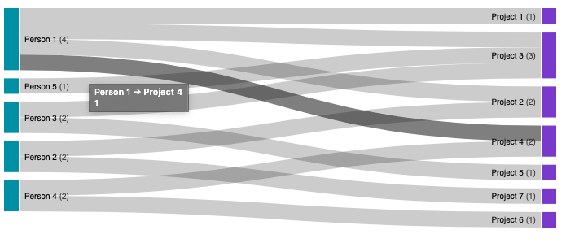

# Sankey Diagram Resource Mapping Example

A D3 sankey diagram data visualization mapping people to projects.



## Usage

To view the example, run the following commands:

```bash
npm install
npm start
```

## References

-   [Sankey Diagrams Wikipedia page](https://en.wikipedia.org/wiki/Sankey_diagram)
-   [D3 API](https://github.com/d3/d3/blob/master/API.md)
-   [Sankey Diagram with v5 example](https://bl.ocks.org/GerardoFurtado/ff2096ed1aa29bb74fa151a39e9c1387)
-   [Flow-o-Matic Sankey diagram visualizer](https://observablehq.com/@mbostock/flow-o-matic)
